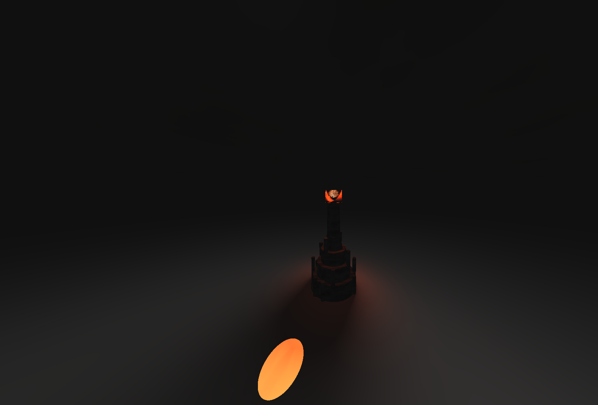
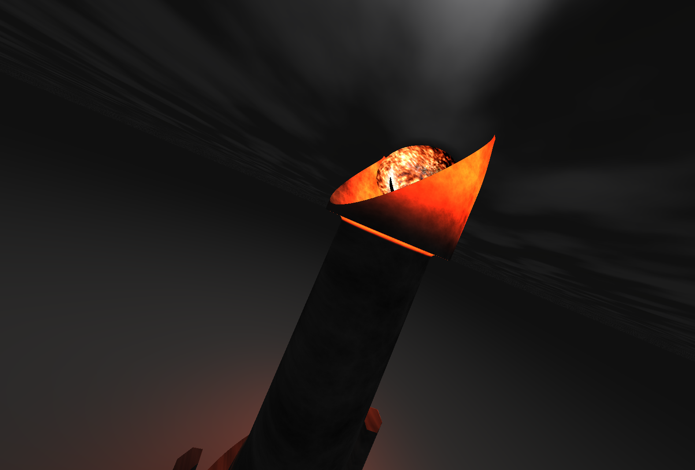

# Environment Setpiece
_Created for CIS 566 Homework 3 in Spring 2019_

_Wei (Waley) Zhang (PennKey: wzha)_

[github.io Demo](https://greedyai.github.io/environment-setpiece/)

## Inspiration
I am a huge fan of _The Lord of the Rings_, so I decided to render Barad-dûr, the stronghold/fortress of the main villain, Sauron.

## Features
- __Scene Elements.__ My scene contains the following objects:
  - Sauron's Eye: An ellipsoid eye animated with fire particle effects and rotational motion, which itself casts a cylindrical beam of light onto the ground below. Created using the following shader techniques:
    - SDF for the ellipsoid shape, blended with a pure particle effect (ie. not bounded by a SDF) to achieve a shape that looks rigid from far away but variable at the edges when closely inspected.
    - Fractal brownian motion (FBM) using a (cubic) smoothed trigonmetric noise function, combined with color remapping for the fire particle effect.
    - Trigonometrically smoothed square wave to animate the rotation of the eyeball.
    - Ambient point light with diffuse shading, high specular reflection, and weak attenuation at the eyeball's center. This gives the fortress an orange glow.
    - Cone light with no attenuation but high intensity, combined with diffuse shading centered at the eyeball's pupil. This gives a beaming-light effect.
  - Barad-dûr: The fortress. Created using the following shader techniques:
    - SDF consisting of various ellipsoids, cylinders, and hexagonal prisms smooth blended together using the Smooth Blend SDF operation.
    - Textured using FBM with a quintic-smoothed worley noise function.
  - Lightning/Procedural Sky: A gloomy, cloudy sky that flashes lightning every few seconds. Created using the following shader techniques:
    - Plane textured using FBM with a standard noise function with quintic falloff for interpolation. The result is then fed into various bias functions to achieve greater contrast between the clouds and the rest of the sky.
    - Lightning intensity controlled by sawtooth-like functions. The base texture color is then remapped to higher intensities based on the lightning intensity. This can be considered as a directional light pointing straight down from the heavens with noise-controlled intensities.
  - Distance fog: To further add to the gloomy effect, a distance fog has been added. This blends the ground and sky nicely at the horizon and makes the lightning effect more "flashy". Created using the following shader techniques:
    - Color remapping based on x-z distance from the camera. At maximum fog distance, all objects blends into a dark grey color. The y coordinate is not considered in calculating the fog. This is done so that when a lightning effect occurs, the entire sky lights up through the fog.
    - Directional light representing the sun near the horizon casting very blurry penumbra shadows onto the fortress. The sun cannot be seen through the fog. The sun gives ambient and diffuse light to all objects in the scene.

## Screenshots
- __Without procedural sky, but including distance fog__

- __With procedural sky, during a lightning flash (zoomed in for better view of the Eye's fire particle effect)__

## Citations
I used various primitive SDF implementations from Inigo Quilez's website [here](http://iquilezles.org/www/articles/distfunctions/distfunctions.htm). For the fire particle effect, I adapted Yuldashev Mahmud's particle effect that I found [here](http://glslsandbox.com/e#41282.0).
